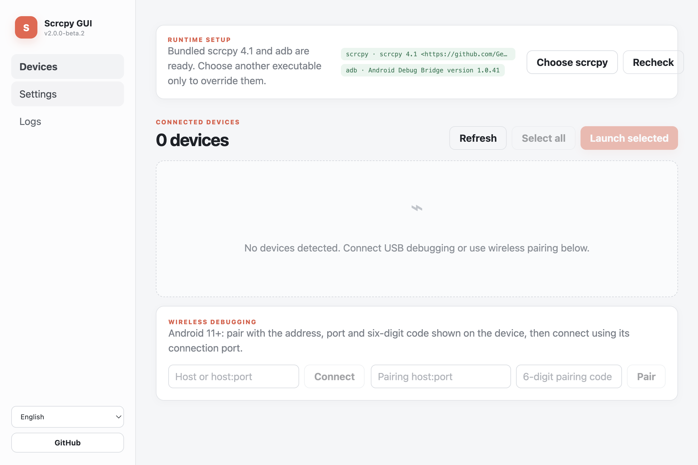
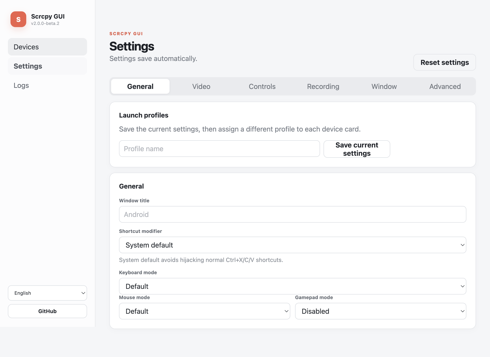

<div align="center">
  
  <h1>Scrcpy GUI</h1>
  <p><strong>A simple, modern desktop interface for scrcpy</strong></p>
  <p>Built with ❤ by <a href="https://github.com/SimonAKing">Simon Ma</a> · <a href="README.zh_CN.md">简体中文</a></p>
</div>

<p align="center">
  <a href="https://github.com/SimonAKing/scrcpy-gui/actions/workflows/validate.yml"></a>
  <a href="https://github.com/SimonAKing/scrcpy-gui/releases"></a>
  <a href="https://github.com/SimonAKing/scrcpy-gui/releases"></a>
  <a href="LICENSE"></a>
  <a href="https://github.com/SimonAKing/scrcpy-gui/issues"></a>
</p>

Scrcpy GUI discovers Android devices over USB or wireless debugging and launches [scrcpy](https://github.com/Genymobile/scrcpy) with a reliable, visual configuration. It supports several devices at once, recording, audio, modern keyboard modes, cropping, window placement, and the current scrcpy 4.x command line.

> Version 2.4 is the first stable release of the ground-up modernization. When reporting a regression, please include the Logs tab output, your operating system, and your scrcpy version.

## Interface



Settings are split into focused General, Video, Controls, Recording, Window, and Advanced sections instead of one long form.

<details>
<summary>View the Settings screen</summary>



</details>

## What is scrcpy?

Scrcpy is a fast, lightweight application maintained by Genymobile. It mirrors and controls Android devices connected through USB or TCP/IP without root access and without leaving an application installed on the device. Scrcpy GUI remains a separate frontend; release packages include an unmodified, checksum-verified official scrcpy bundle for easier installation, under scrcpy's own license.

## Highlights

- Native scrcpy performance, image quality, audio, keyboard, mouse, clipboard, drag-and-drop, and recording
- Automatic USB discovery and clear unauthorized/offline device states
- Verified official scrcpy 4.1 and adb bundled with release packages; no PATH setup required
- Android 11+ wireless pairing with `adb pair`, plus direct TCP/IP connection for legacy setups
- Simultaneous multi-device launch with duplicate-process protection
- Named profiles, per-device configuration and aliases, saved wireless addresses, and opt-in automatic launch
- Clickable Android controls, computer screenshots, touch-indicator controls, and recorded ADB action replay
- Video bitrate, size, frame rate, orientation, codec, crop, and window controls
- Audio, control, stay-awake, turn-screen-off, touch indicators, fullscreen, borderless, and always-on-top options
- SDK, UHID, and AOA keyboard modes, with a configurable scrcpy shortcut modifier
- Real launch status and stderr logs instead of reporting success before scrcpy is running
- Optional notification muting and minimize-to-tray behavior
- English, Simplified Chinese, Traditional Chinese, and Russian interface languages
- Sandboxed Electron renderer, context isolation, restricted IPC, and argument-safe process launching
- Automated validation and release builds for Windows, macOS, and Linux

## Version 2 compared with 1.5

The 2.0 line replaces the original 2018 Electron/Vue stack and its scrcpy 1.x flags. It includes a new interface, current scrcpy arguments, direct process supervision, Android 11+ pairing, multi-device reliability, diagnostics, security hardening, automated tests, and cross-platform release automation. Existing 1.x configuration is intentionally not imported because several old options no longer have the same scrcpy meaning.

## Requirements

1. Android 5.0 (API 21) or later. Audio forwarding requires the Android version supported by scrcpy.
2. Enable **Developer options → USB debugging** on the device. Some vendors expose an additional security option for keyboard and mouse control.
3. Use the verified scrcpy 4.1 and `adb` bundled in official Scrcpy GUI release packages, or select your own compatible scrcpy 4.x executable.

Release packages work without configuring `PATH`. If you choose another `scrcpy` executable, Scrcpy GUI also searches its directory, `PATH`, common Homebrew locations, and standard Android SDK locations for `adb`.

## Install

Download the package for your platform from [GitHub Releases](https://github.com/SimonAKing/scrcpy-gui/releases):

- **Windows:** x64 or 32-bit x86 installer (`.exe`) / portable `.zip`
- **macOS:** Intel or Apple Silicon `.dmg` / `.zip`
- **Linux:** `.AppImage`, Debian (`.deb`), Arch (`.pacman`), or portable `.tar.gz`

The current stable artifacts are not code-signed or notarized. Your operating system may ask you to confirm that you trust the downloaded application. Verify the download against the release `SHA256SUMS.txt` before opening it.

Releases from v2.4.1 also include an SPDX SBOM and GitHub build-provenance attestations. After downloading an asset, verify its workflow identity with `gh attestation verify PATH/TO/ASSET -R SimonAKing/scrcpy-gui` in addition to checking the SHA-256 manifest.

The exact automated checks, SBOM/provenance evidence, and unverified hardware matrix are recorded in the [v2.4.1 release smoke report](docs/RELEASE_SMOKE_V2.4.1.md). The earlier three-platform install/upgrade/uninstall evidence remains in the [v2.4.0 report](docs/RELEASE_SMOKE_V2.4.0.md).

### Use another scrcpy installation

The bundled runtime is usually enough. To override it, Windows users can download another official archive from the [scrcpy releases](https://github.com/Genymobile/scrcpy/releases) page, extract it, then select `scrcpy.exe` from Scrcpy GUI.

On macOS with Homebrew:

```bash
brew install scrcpy android-platform-tools
```

On Linux, use a current package from your distribution or follow the official [scrcpy Linux documentation](https://github.com/Genymobile/scrcpy/blob/master/doc/linux.md). Distribution packages may lag behind; Scrcpy GUI 2.0 requires scrcpy 4.x.

## Use

### Wired connection

1. Enable USB debugging and connect the device with a data-capable USB cable.
2. Accept the computer authorization prompt on the device.
3. Wait for the device card to appear. An `unauthorized` card means the phone is still waiting for approval.
4. Select one or more devices and choose **Launch selected**.

### Android 11+ wireless debugging

1. Put the computer and device on the same network.
2. Enable **Developer options → Wireless debugging**.
3. On the device, choose **Pair device with pairing code**.
4. Enter the displayed pairing address (including its port) and six-digit code in Scrcpy GUI, then choose **Pair**.
5. Enter the separate connection address shown on the Wireless debugging page and choose **Connect**.
6. Select the connected device and launch it.

The pairing port and connection port are usually different. Hostnames, IPv4, bracketed IPv6, and ports from 1–65535 are accepted.

Every successful connection address is remembered. Rename it for clarity and enable **Connect at startup** only for stable addresses that should be retried when Scrcpy GUI opens.

### Legacy wireless connection

For devices using ADB over TCP/IP, enable the device's TCP/IP mode while connected over USB, then connect to `device-ip:5555`. Avoid exposing an unauthenticated ADB port outside a trusted local network.

### Multiple devices

Select several authorized device cards and launch them together. Each scrcpy process is tracked separately, so a failure on one device does not report the others as successful and the same serial cannot be launched twice accidentally.

Save the current Settings as a named launch profile, then assign a profile to each device card. Device aliases are saved by serial and become the scrcpy window title unless the profile supplies an explicit title. **Launch automatically** is opt-in per device and is guarded against duplicate launches.

### Device controls and automation

Choose a target in the control panel to click Back, Home, recent apps, Menu, volume, power, screen power, rotation, and touch-indicator controls without memorizing scrcpy shortcuts. **Screenshot** uses `adb exec-out screencap` and validates the PNG before saving it to the computer.

Choose **Record actions**, use the control buttons, then stop and save the sequence. The Automations page can also build normalized tap/swipe, non-sensitive text, app-start, screenshot, delay, control, and device-assertion steps. Imported automations open as untrusted previews; arbitrary shell commands and persisted sensitive text are rejected.

Save selected devices as a Device group with a default launch profile and concurrency limit. Before launching, controlling, taking screenshots, pushing files, installing an APK, starting an app, or running an automation, the batch view shows online/authorization state, capabilities, session conflicts, target geometry, and the exact planned action for every device. Failed preflight items stay visible, partial runs never report overall success, and input/overwrite/downgrade actions require confirmation. Active automation runs can be canceled and their per-device reports are saved in Artifacts.

### Recording

Enable recording in Settings, choose an `.mp4` or `.mkv` destination, then launch the device. **No playback** records without showing a mirror window.

### Extra arguments

Place one complete scrcpy argument on each line. Scrcpy GUI passes each line as one process argument without a shell. Device serial overrides (`-s` and `--serial`) are rejected because the selected device card owns that value.

### Boss key and ADB shutdown

The optional global Boss key immediately closes every active mirror and hides Scrcpy GUI; restore the main window from its tray icon. The default shortcut is `Ctrl/Cmd+Shift+B` and can be changed. If this GUI owns your ADB workflow, you may also opt into stopping the shared ADB server on quit; leave that disabled when Android Studio or another tool shares the server.

## Scrcpy shortcuts

The shortcut modifier is controlled by scrcpy and may vary by platform. Keep **System default** unless you deliberately want another modifier. Common shortcuts include:

| Action | Shortcut |
| --- | --- |
| Toggle fullscreen | `MOD` + `f` |
| Resize to pixel-perfect | `MOD` + `g` |
| Resize to fit the device | `MOD` + `w` |
| Home / Back / App switch | `MOD` + `h` / `b` / `s` |
| Volume up / down | `MOD` + `↑` / `↓` |
| Power | `MOD` + `p` |
| Turn device screen off / on | `MOD` + `o` / `Shift` + `o` |
| Rotate the device | `MOD` + `r` |
| Copy / Cut / Paste | `MOD` + `c` / `x` / `v` |
| Toggle FPS counter | `MOD` + `i` |

See the current [scrcpy control documentation](https://github.com/Genymobile/scrcpy/blob/master/doc/control.md) for the complete list. File drag-and-drop, APK installation, clipboard behavior, and these shortcuts are implemented by the launched scrcpy window.

## Troubleshooting

- **No device appears:** run `adb devices -l`, unlock the device, and accept the authorization prompt.
- **scrcpy is not found:** choose the exact executable in Runtime setup or add it to `PATH`.
- **The mirror closes immediately:** open the **Logs** tab and inspect scrcpy stderr; it contains the real failure from the process.
- **Keyboard shortcuts do not work:** restore the shortcut modifier to System default and check scrcpy's current shortcut table.
- **Mouse control is rejected by a vendor ROM:** enable the vendor's additional USB debugging/security control option.
- **Green, black, or blurry video:** first reproduce with the same command in scrcpy itself; codec/rendering failures are device, driver, or scrcpy-layer behavior, while the Logs tab exposes the exact command and error for diagnosis.
- **Crop or window sizing is rejected:** width and height must both be zero or both be positive.

More diagnostics and known boundaries are tracked in [GitHub Issues](https://github.com/SimonAKing/scrcpy-gui/issues).

## Development

Node.js 22 or later is recommended.

```bash
npm ci
npm test
npm run dev
```

Production checks and packaging:

```bash
npm run typecheck
npm run build
npm run build:dir
```

The app uses Electron, Vue 3, TypeScript, Vite, and electron-builder. Main-process integration lives in `src/main/`, the sandboxed renderer in `src/renderer/`, shared IPC contracts in `src/shared/`, and pure argument/address logic in `tests/`.

Please read [CONTRIBUTING.md](CONTRIBUTING.md) before opening a pull request. Bug reports should include reproducible steps, platform and version details, plus the relevant Logs tab output.

The proposed product direction, functional requirements, architecture, security boundaries, and implementation milestones are documented in the [Product and technical specification (Simplified Chinese)](docs/PRODUCT_TECHNICAL_SPEC.zh_CN.md).

## Community and credits

- Questions, bugs, and feature requests: [GitHub Issues](https://github.com/SimonAKing/scrcpy-gui/issues)
- Security vulnerabilities: follow the private process in [SECURITY.md](SECURITY.md), not a public issue
- The Russian translation was originally contributed by [@dEN5-tech](https://github.com/dEN5-tech) in [#69](https://github.com/SimonAKing/scrcpy-gui/pull/69) and migrated to the 2.0 interface.
- Thanks to [Genymobile/scrcpy](https://github.com/Genymobile/scrcpy) and every Scrcpy GUI contributor.

## Support the project

If Scrcpy GUI is useful to you, starring the repository, reporting a reproducible issue, improving documentation, or contributing a pull request all help the project. You can also support the original author through [PayPal](https://paypal.me/tomotoes).

## License

Scrcpy GUI is licensed under [GNU GPLv3](LICENSE). Scrcpy is a separate project distributed under its own license.
