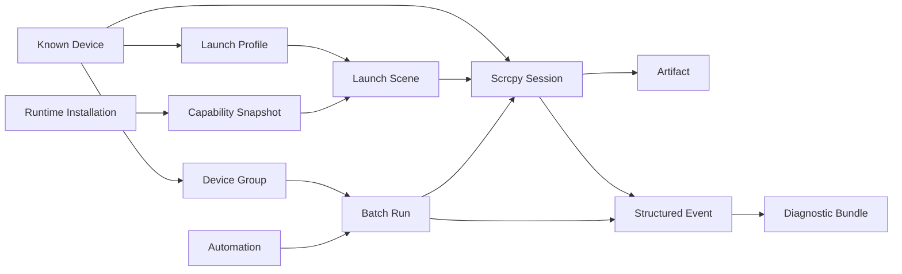
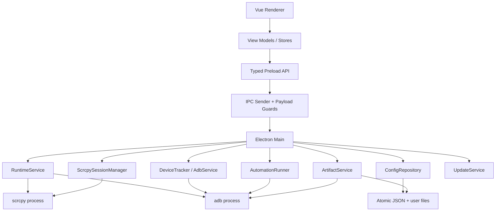

# Scrcpy GUI 产品与技术功能规格

> 状态：提案（Proposed）
>
> 文档版本：1.0
>
> 调研基线：2026-08-15
>
> 适用代码基线：`v2.0.0-beta.3` 及之后版本
>
> 维护者：Simon Ma 与 Scrcpy GUI contributors

> 实施进度（2026-08-15）：M1 的 OptionDescriptor、CapabilityRegistry、命令预览、SessionManager、DeviceTracker、结构化事件/错误、Sessions 页面和 Config V3 已落地；M2 的设备工作区、文件推送、APK 安装、应用列表/启动、ArtifactService、脱敏诊断包、Issue helper 和 Profile 导入导出已落地；M3 的六类场景领域模型、官方 argv 序列化、场景冲突矩阵和 Profile 往返已落地，设备级探测、场景向导与硬件烟测仍在实施。M0 的三平台真实设备矩阵、Chocolatey 社区审核和 Stable 验收仍待外部条件完成；M4 尚未开始。

## 0. 文档目的

本文不是宣传页，也不是把所有可能的功能罗列成愿望清单。它用于回答以下工程问题：

1. Scrcpy GUI 要服务哪些用户，解决哪些真实问题；
2. 哪些能力属于产品核心，哪些能力明确不做；
3. 功能如何映射到 scrcpy 4.1、ADB 与当前 Electron 架构；
4. 每个模块的交互、状态、数据、权限、错误和验收条件是什么；
5. 如何按可交付里程碑实施，而不通过制造无意义提交来营造活跃度；
6. 如何让 issue、PR、测试、Release 和用户反馈形成可审计的真实维护记录。

本文是后续功能 issue、设计评审、PR 拆分与版本验收的共同依据。实现与本文冲突时，应先更新本文或在 PR 中记录经过评审的偏差。

## 1. 执行摘要

Scrcpy GUI 的产品定位是：

> **官方 scrcpy 的可信桌面控制面：让普通用户无需记忆命令，让专业用户保留完整控制，让多设备任务可复现、可诊断、可审计。**

产品继续直接启动未经修改的官方 scrcpy 客户端，而不是重新实现视频编解码、控制协议或嵌入式镜像内核。这样可以继承 scrcpy 的低延迟、设备兼容性和快速迭代，并把有限维护资源集中在 scrcpy 原生不负责的部分：

- 运行时安装与兼容性判断；
- 设备发现、配对、命名与状态解释；
- 可视化命令构建与场景化配置；
- 多设备会话、窗口和批量操作；
- 截图、录像、文件、应用和产物管理；
- 安全、有限、可预览的自动化；
- 结构化日志、诊断包和可复现问题报告；
- 跨平台安装包、升级提示和供应链校验。

下一阶段不应以“覆盖全部约 100 个 scrcpy 长参数”为目标。正确模型是四层能力：

1. **场景向导**：将屏幕镜像、相机、虚拟显示、录制、OTG 等互斥参数组合成可靠流程；
2. **常用可视化设置**：为高频且稳定的参数提供有校验的控件；
3. **专家参数**：逐行 argv 透传，同时给出冲突、风险和版本提示；
4. **能力注册表**：以 scrcpy 版本和平台为条件，决定哪些控件、默认值与组合可用。

## 2. 设计原则

### 2.1 上游优先

- 只从 [Genymobile/scrcpy](https://github.com/Genymobile/scrcpy) 官方 Release 获取内置运行时；
- 构建阶段固定版本、资产名和 SHA-256，不在运行时静默替换二进制；
- 不维护私有 scrcpy fork，不复制其视频或控制协议实现；
- 新参数必须先以官方文档和实际 `scrcpy --help` 为准；
- GUI 的默认行为不得改变 scrcpy 的安全边界或设备要求。

### 2.2 渐进式复杂度

- 首屏只回答三个问题：环境是否就绪、设备是否可用、下一步能做什么；
- 高频设置进入基础页，低频设置进入高级页，互斥模式进入独立向导；
- 用户不需要理解端口转发、编码器约束或 ADB transport 才能完成基础投屏；
- 专业用户始终能够看到最终 argv，并可复制为可复现命令。

### 2.3 离线与本地优先

- 核心投屏、控制、配置和诊断无需账户、云服务或互联网；
- 不默认上传遥测、日志、设备序列号、IP、文件名或应用清单；
- 更新检查失败不能影响设备发现与启动；
- 远程广域网访问不是默认能力，用户应自行提供安全隧道。

### 2.4 安全默认值

- 所有进程都使用可执行文件加 argv 数组启动，禁止拼接 shell 命令；
- Renderer 保持 `nodeIntegration: false`、`contextIsolation: true`、`sandbox: true`；
- IPC 输入在主进程边界再次校验，不信任 TypeScript 类型本身；
- 自动化只接受结构化动作；任意 shell/ADB shell 不进入共享、导入或批量执行路径；
- 配对码不持久化；诊断导出默认脱敏序列号、IP 和本地路径。

### 2.5 可恢复、可解释

- 每个长任务都具有明确状态、取消能力和最终结果；
- 批量操作必须逐设备显示成功、失败与跳过原因；
- 错误信息必须包含实际执行阶段、退出码、相关 stderr 与建议动作；
- 配置迁移失败时保留原文件和上一个可用备份，不静默清空设置。

### 2.6 真实维护

- 提交按真实逻辑边界拆分，不以固定数量或随机数量作为目标；
- 每个关闭的用户 issue 应说明修复内容、发布版本与验证方式；
- 两个月可以作为一次稳定版候选窗口，但不得倒签提交日期或补写虚假历史；
- 活跃维护证据来自可运行功能、评审、测试、Release、issue triage 和安全响应。

## 3. 目标与非目标

### 3.1 产品目标

| 编号 | 目标 | 衡量方式 |
| --- | --- | --- |
| G-01 | 新用户在不了解 scrcpy CLI 的情况下完成首次 USB 投屏 | 首次成功任务中位数不超过 3 分钟 |
| G-02 | Android 11+ 用户完成无线配对与重连 | 有引导时一次成功率不低于 85% |
| G-03 | 专业用户能够构造并复用复杂配置 | 每个启动会话可预览、复制、保存完整 argv |
| G-04 | 多设备任务不会漏开、重复打开或丢失结果 | 每个请求产生唯一 session，并逐项返回结果 |
| G-05 | 用户能够自行生成高质量 issue 证据 | 一键诊断包包含版本、状态、命令、脱敏日志与检查结果 |
| G-06 | 新 scrcpy 稳定版可以低风险接入 | 能力清单、参数测试、资产校验和跨平台烟测全部通过 |
| G-07 | 安装包无需用户另行配置 PATH | 正式 Release 内置经过校验的 scrcpy 与 ADB |

### 3.2 工程目标

- 将参数、能力、校验与 UI 元数据从单个大型组件中解耦；
- 将进程生命周期从“按设备存一个 ChildProcess”升级为显式 session 状态机；
- 将持久配置从 Renderer `localStorage` 迁移到主进程拥有的、带 schema version 的原子文件；
- 使用事件驱动的设备追踪代替固定频率的全量轮询，并保留兼容回退；
- 建立可替换的 ADB、scrcpy、文件和更新服务边界；
- 用 fake binaries 覆盖超时、退出码、重复启动、取消、部分失败等集成场景。

### 3.3 明确非目标

- 不重新实现 scrcpy server/client 协议；
- 不在 v2.x 内嵌实时镜像画面；官方 SDL 窗口继续负责低延迟显示和输入；
- 不提供绕过 Android USB 调试授权、锁屏或厂商安全设置的能力；
- 不默认扫描公网、端口段或未知局域网主机；
- 不提供云中继、远程桌面 SaaS、账户系统或跨互联网设备控制；
- 不提供可从网络下载并执行的脚本、插件或任意命令市场；
- 不承诺 ADB 输入能够达到游戏级低延迟按键映射；该能力需要独立技术验证；
- 不把竞品私有扩展、付费 AI 功能或闭源协议列为必须追赶范围；
- 不以提交数量、GitHub 绿点或伪造日期作为成功指标。

## 4. 调研范围与证据

### 4.1 上游基线

- [scrcpy v4.1 Release](https://github.com/Genymobile/scrcpy/releases/tag/v4.1)：当前集成基线；
- [scrcpy 官方 README](https://github.com/Genymobile/scrcpy)：能力总览与官方来源声明；
- 正式包内置的 `scrcpy --help`：本次审计得到约 100 个长参数；
- [Android Debug Bridge 官方文档](https://developer.android.com/tools/adb)：设备状态、无线调试与 mDNS 行为；
- [Electron Security](https://www.electronjs.org/docs/latest/tutorial/security)：Renderer 隔离、IPC sender 校验、导航与外部链接约束。

scrcpy 4.1 相比 4.0 的直接相关变化包括 VP8/VP9、编码器尺寸约束修复、`--ignore-video-encoder-constraints`、媒体扫描与依赖升级。当前 GUI 已把 VP8/VP9 作为一等视频编码选项；新增但尚未可视化的标志可通过专家参数使用。

### 4.2 竞品样本

调研只用于识别成熟交互与风险，不代表复制其实现或商业功能。统计是 2026-08-15 的快照，会自然变化。

| 产品 | 快照规模 | 公开定位与优势 | 对本项目的启示 |
| --- | ---: | --- | --- |
| [QtScrcpy](https://github.com/barry-ran/QtScrcpy) | 约 31.4k stars | C++/Qt/OpenGL；多设备、分组控制、按键映射、文件/APK、ADB 快捷动作 | 多设备需要“组”和逐设备结果；按键映射必须独立建模，不能只存字符串 |
| [Escrcpy](https://github.com/viarotel-org/escrcpy) | 约 10.7k stars | Electron/Vue；嵌入镜像、集成控制栏、LAN 发现、多设备编排、自动化；部分高级能力来自私有扩展 | 控制入口应贴近设备上下文；开源核心与私有能力边界必须透明 |
| [Scrcpy-GUI (Flutter)](https://github.com/GeorgeEnglezos/Scrcpy-GUI) | 约 449 stars | 可视命令构建、相机、虚拟显示、收藏、命令预览、脚本导出、App Drawer | 模式化面板与命令预览价值高；全部参数平铺会增加认知负担 |
| [guiscrcpy](https://github.com/srevinsaju/guiscrcpy) | 约 3.1k stars，已归档 | Python/PyQt；侧边控制、网络管理、设备信息、多设备与桌面快捷方式 | 独立控制面板有价值；长期维护成本和界面拥挤是明确风险 |
| 本项目 | 约 3.9k stars | 官方 scrcpy launcher；安全 IPC、内置运行时、配置、多设备、控制、自动化、跨平台 Release | 应以可信、简洁、可诊断为差异点，而不是重新造镜像内核 |

### 4.3 可学习但不直接复制的模式

1. **设备上下文操作栏**：来自 Escrcpy/QtScrcpy；适合截图、旋转、文件、应用与自动化入口；
2. **命令预览**：来自 Flutter Scrcpy-GUI；能帮助专家验证，也能让 issue 可复现；
3. **配置收藏与使用频率**：适合在配置很多时排序，但不应默认收集或上传使用数据；
4. **设备分组**：适合测试机房、展陈和批量演示；必须有 preflight 与部分失败语义；
5. **App Drawer**：适合 `--start-app`，但应用清单获取慢，应按设备缓存并显式刷新；
6. **可调整控制栏**：入口可以排序，底层动作仍必须是固定结构化类型；
7. **LAN 自动发现**：优先使用 ADB mDNS 服务，而不是无边界端口扫描；
8. **脚本导出**：可以导出可读命令，但导入时不得自动信任任意 shell 文件。

### 4.4 明确不采用的竞品模式

- 不为追求嵌入式镜像而维护独立视频解码/渲染栈；
- 不把 AI 控制设为基础功能或默认联网能力；
- 不允许自动化下载外部脚本后直接执行；
- 不宣传未经硬件矩阵验证的设备数量、延迟或性能上限；
- 不把一百个参数全部放在同一滚动页面；
- 不以“无限功能”牺牲可理解的错误、取消和权限边界。

## 5. 当前产品审计

### 5.1 已具备能力

`v2.0.0-beta.3` 已经具备以下基础：

- Electron 43、Vue 3、TypeScript、Vite；
- `contextIsolation`、sandbox、无 Renderer Node 集成；
- 正式包内置校验后的 scrcpy 4.1 和 ADB；
- USB 与无线设备发现、Android 11+ pairing、连接与断开；
- 多设备选择、逐设备配置、别名、自动选择和受控自动启动；
- 视频编码、码率、尺寸、帧率、缓冲、音频、输入、窗口、录制与专家参数；
- 点击式 Back/Home/Recent/Menu/音量/电源/旋转/触摸点控制；
- PNG 截图与安全动作录制/回放；
- stdout/stderr 日志、托盘、Boss 键、退出时可选关闭 ADB；
- macOS、Windows x64/ia32、Linux 多格式与 Chocolatey `.nupkg` 发布；
- 28 项参数与解析测试、三平台 CI。

### 5.2 当前架构

```text
Vue Renderer
  └─ window.scrcpy typed API
       └─ sandboxed preload / contextBridge
            └─ ipcMain handlers
                 ├─ processes.ts: ADB、截图、控制、自动化、scrcpy 进程
                 ├─ scrcpy.ts: 参数构建与纯校验
                 └─ Electron: dialog、tray、shortcut、external URL
```

现有边界是正确的，但职责开始集中：Renderer 单文件同时拥有持久化、业务状态和所有页面；`processes.ts` 同时负责 binary 解析、ADB、会话、控制、截图与自动化；IPC 依赖编译期类型，缺少统一运行时 schema 和 sender 校验。

### 5.3 当前参数覆盖

当前提供一等 UI/构建支持的参数约 30 个，包括：

- 设备与窗口：`--serial`、title、position、size、borderless、fullscreen、always-on-top；
- 视频：codec、bitrate、max-size、max-fps、orientation、crop、video-buffer；
- 音频：开关、audio-buffer；
- 输入：keyboard、mouse、gamepad、shortcut modifier、control；
- 设备行为：turn-screen-off、stay-awake、show-touches；
- 录制：record、no-playback/no-window；
- 其他：display-id、push-target、port、window aspect ratio lock。

仍缺少场景化 UI 的主要上游能力包括：相机、虚拟显示、OTG、应用启动、音频源/编码器、视频编码器、V4L2、time limit、TCP/IP 向导、列表查询和编码器约束。它们不应逐个变成孤立 checkbox，而应归入后文定义的模式与能力系统。

### 5.4 历史 issue 主题

历史 issue 提供了比竞品列表更可靠的需求证据：

| 主题 | 代表 issue | 产品要求 |
| --- | --- | --- |
| scrcpy/ADB 路径与启动失败 | #8、#10、#26、#53、#101、#116 | 内置运行时、分阶段诊断、实际 stderr |
| 设备兼容与黑屏/无窗口 | #1、#9、#14、#22、#31、#44、#48、#120 | 会话状态机、超时、设备/编码器诊断 |
| 无线连接 | #15、#23、#42、#45、#61、#93、#127、#132、#147 | pairing、mDNS、保存目标、清晰地址状态 |
| 多设备 | #64、#72、#75、#80、#92、#114、#138 | 唯一 session、逐设备配置、部分失败结果 |
| 输入与快捷键 | #6、#13、#27、#41、#81、#83、#85、#155、#158 | 输入模式解释、剪贴板诊断、映射研究 |
| 音频 | #7、#34、#52、#58、#125、#129 | 以原生 scrcpy 音频替代历史 sndcpy 路径 |
| 文件与剪贴板 | #27、#68、#104、#111、#122 | push 目标、安装 APK、传输结果和剪贴板指导 |
| 控制与截图 | #17、#84、#105、#131 | 点击控制栏、双向状态、截图产物 |
| 录制 | #46、#55、#103、#126 | 文件名、目录、无预览录制、缓冲配置 |
| 打包与安装 | #32、#36、#40、#66、#73、#90 | 完整平台资产、便携包、可复现构建 |
| UI 与安全 | #4、#25、#49、#57、#71、#119、#140 | 当前 Electron、安全 CSP、响应式布局、图标资产 |

### 5.5 主要缺口

1. 设备刷新是定时轮询，没有持久 `track-devices` 事件源；
2. 会话以 serial 为键，不能自然表达同设备的屏幕、相机、录制等并行模式；
3. 配置仍在 Renderer `localStorage`，缺少原子写入、备份、迁移报告和导入导出；
4. 没有最终命令预览和“为什么产生这个参数”的解释；
5. 日志是文本流，没有阶段、命令、退出码、耗时和环境快照；
6. 缺少应用、文件、录像与截图的统一产物视图；
7. 自动化动作范围安全但很窄，缺少条件、坐标、逐设备执行与取消；
8. 没有运行时能力探测，UI 主要依赖固定 scrcpy 4.x 假设；
9. IPC 未统一做 sender 与 payload 运行时校验；
10. Release 已自动化，但应用内还没有清晰、安全的更新提示策略。

## 6. 用户与任务模型

### 6.1 用户角色

#### P1：临时投屏用户

- 目标：尽快把一台手机画面投到电脑；
- 知识：不了解 ADB/scrcpy 参数；
- 需求：明确的 USB 授权提示、默认配置、一键启动、声音和全屏；
- 失败容忍度：低；任何“成功但没有窗口”都视为产品失败。

#### P2：日常无线用户

- 目标：固定手机在同一局域网内反复连接；
- 知识：知道开发者选项，但不想记 IP/动态端口；
- 需求：pairing 引导、mDNS 发现、设备别名、可信自动重连；
- 风险：IP 变化、网络隔离、端口混淆、ADB server 被其他工具共享。

#### P3：开发与测试人员

- 目标：同时观察多设备、切换分辨率、录像、截图、启动特定应用；
- 知识：能阅读命令和日志；
- 需求：配置、应用启动、会话监控、诊断包、可复制 argv；
- 风险：重复会话、漏开、部分失败、日志缺乏上下文。

#### P4：演示、展陈与内容生产人员

- 目标：稳定窗口布局、隐藏设备屏幕、录制、快速恢复预设；
- 知识：关注效果而非参数；
- 需求：场景预设、窗口编排、自动文件名、Boss 键、状态可见；
- 风险：窗口位置受显示器变化影响、录制覆盖、音视频不同步。

#### P5：小规模设备管理人员

- 目标：对一组测试机执行同一安全动作、截图或启动应用；
- 知识：理解设备差异和失败；
- 需求：分组、preflight、并发限制、逐设备结果、可取消自动化；
- 风险：把危险命令广播到错误设备、设备离线、权限不一致。

### 6.2 核心 Jobs to Be Done

1. 当我第一次连接 Android 设备时，我想知道缺少哪一步，从而无需查命令行文档；
2. 当我再次使用固定设备时，我想直接恢复别名、配置和无线目标；
3. 当我配置画质、音频或窗口时，我想看到最终命令并知道冲突；
4. 当我同时启动多台设备时，我想知道每台设备的独立结果；
5. 当镜像未出现时，我想导出足够证据，而不是只看到“启动成功”；
6. 当我录制或截图时，我想从应用内找到文件和其来源设备；
7. 当我运行自动化时，我想先预览目标和动作，并能中途停止；
8. 当上游升级时，我想知道当前 GUI、二进制和参数是否兼容。

### 6.3 关键成功路径

```text
首次启动
  → 运行时自检
  → USB/无线设备发现
  → 设备授权状态解释
  → 使用推荐配置启动
  → 收到 first-running 或明确 error
  → 可选保存设备别名/配置
```

```text
重复使用
  → 识别已知设备
  → 恢复设备默认场景
  → 预览差异
  → 启动并跟踪 session
  → 从设备工作区执行截图/控制/产物操作
```

```text
批量任务
  → 选择设备组
  → preflight（在线、授权、能力、冲突）
  → 确认动作与并发数
  → 执行
  → 逐设备结果
  → 重试失败项或导出报告
```

## 7. 信息架构与导航

### 7.1 一级导航

| 页面 | 目的 | 默认可见内容 |
| --- | --- | --- |
| 设备 | 发现设备并进入单设备/多设备工作区 | 运行时健康、设备列表、无线入口、最近场景 |
| 会话 | 查看所有正在启动、运行、停止或失败的 scrcpy 实例 | 状态、模式、设备、启动时间、命令摘要、停止 |
| 产物 | 统一查看截图、录像、诊断包和传输记录 | 设备、类型、时间、路径、打开/定位/删除 |
| 自动化 | 编辑、预览和执行结构化工作流 | 宏列表、步骤、目标、最近运行 |
| 设置 | 管理应用、运行时、默认值、安全和更新 | 分组设置，支持搜索与恢复默认 |
| 日志 | 查看结构化事件和导出诊断 | 过滤器、时间线、命令、stderr、环境信息 |

“设备”仍是默认页。当前 Logs 页保留，但未来日志与诊断共享同一事件模型。设置页不承担设备状态和运行任务。

### 7.2 设备页布局

设备页按稳定层级组织：

1. **环境状态条**：scrcpy、ADB、版本、来源、检查按钮；仅异常时展开说明；
2. **设备列表**：每个设备显示别名、型号、连接方式、授权状态、默认场景和运行状态；
3. **选择操作**：启动、批量动作、加入组；无选择时禁用并解释；
4. **无线设备区域**：已保存目标、mDNS 建议、pairing/连接向导；
5. **最近使用**：最近设备与场景组合，不在首版保存行为频率到云端。

### 7.3 设备详情/工作区

选择一台设备进入右侧详情或独立页面，包含：

- Overview：连接、系统、显示、能力和当前会话；
- Mirror：场景选择、参数摘要、命令预览、启动；
- Control：安全控制动作、剪贴板帮助、截图；
- Apps：应用列表、搜索、启动、停止（按能力和版本展示）；
- Files：推送、APK 安装、目标目录和历史；
- Automation：适用于该设备的宏和最近结果；
- Diagnostics：设备级检查与日志过滤。

不把实时镜像嵌入该工作区；Mirror 页管理的是官方 scrcpy 外部窗口的生命周期。

### 7.4 设置分组

| 分组 | 内容 |
| --- | --- |
| General | 语言、启动页、托盘、提示、退出行为 |
| Runtime | 内置/自定义 scrcpy、ADB 来源、版本兼容、更新策略 |
| Defaults | 新设备默认场景、录像/截图目录、窗口规则 |
| Devices | 已知设备、别名、默认场景、自动连接/自动启动 |
| Automation | 默认并发、超时、危险动作确认、历史保留 |
| Privacy | 日志保留、脱敏、诊断导出、更新网络访问 |
| Shortcuts | Boss 键与应用级快捷键冲突检测 |
| Advanced | 专家参数策略、ADB server 所有权、调试输出 |

### 7.5 响应式规则

- 支持窗口宽度范围以 `BrowserWindow.minWidth` 到 1600px 为基线；
- 布局判断必须考虑侧栏后的容器宽度，不只使用 viewport breakpoint；
- 任何按钮组都不能依赖 `white-space: nowrap` 与固定多列最小宽度共同成立；
- 880px 下不允许横向页面滚动；表格可在自身容器横向滚动；
- 1120×780、880×640、1440×900 是自动视觉验收视口；
- 200% 系统缩放下关键流程仍可操作，状态不能只靠颜色表达。

## 8. 领域对象模型

### 8.1 对象关系



### 8.2 RuntimeInstallation

表示实际使用的 scrcpy/ADB 组合，而不是只有一个 `scrcpyPath`。

```ts
interface RuntimeInstallation {
  id: string
  source: 'bundled' | 'custom'
  scrcpyPath: string
  adbPath: string
  scrcpyVersion: string
  adbVersion: string
  platform: 'darwin' | 'win32' | 'linux'
  arch: 'arm64' | 'x64' | 'ia32'
  verified: boolean
  verifiedAt: string
  capabilitySnapshotId: string
}
```

规则：

- bundled runtime 的路径由主进程根据 `process.resourcesPath` 解析，Renderer 不持久化绝对路径；
- custom runtime 要同时解析同目录或显式选择的 ADB；
- 切换 runtime 前进行版本、可执行权限、server 文件和基础命令检查；
- 自定义路径不存在时回退到 bundled，但必须显示回退事件；
- `verified` 对 bundled 表示构建链校验，对 custom 只表示本机可执行检查，不暗示供应链可信。

### 8.3 CapabilitySnapshot

能力快照来自版本、平台和只读探测命令。

```ts
interface CapabilitySnapshot {
  id: string
  scrcpyVersion: string
  capturedAt: string
  flags: string[]
  videoEncoders: EncoderInfo[]
  audioEncoders: EncoderInfo[]
  displays: DisplayInfo[]
  cameras: CameraInfo[]
  supports: {
    audio: boolean
    camera: boolean
    virtualDisplay: boolean
    otg: boolean
    v4l2: boolean
    vp8: boolean
    vp9: boolean
  }
}
```

- 首次运行和 runtime 变化时更新；
- 设备相关的 displays/cameras/encoders 按 device serial 单独缓存；
- 探测失败不阻止基础镜像，但相关模式显示“未验证”；
- UI 不根据字符串版本猜测全部能力；版本规则只是无法探测时的回退。

### 8.4 KnownDevice

```ts
interface KnownDevice {
  id: string                 // 本地稳定 id，不直接用显示名称
  lastSerial: string
  fingerprint?: string       // 可获得时使用只读设备属性组合
  alias: string
  model: string
  lastConnection: 'usb' | 'wireless'
  defaultProfileId?: string
  groupIds: string[]
  autoConnect: boolean
  autoLaunch: boolean
  firstSeenAt: string
  lastSeenAt: string
}
```

- TCP/IP serial 会变化，不能单独充当永久身份；
- 不读取或持久化 IMEI、电话号码、账户等敏感标识；
- fingerprint 必须由非敏感只读属性组成并可被用户清除；
- 同一实体通过 USB/Wi-Fi 出现时，只在证据足够时建议合并，不能静默合并。

### 8.5 LaunchProfile 与 LaunchScene

Profile 是可复用参数；Scene 是模式化入口。

```ts
type SceneKind =
  | 'screen'
  | 'camera'
  | 'virtual-display'
  | 'record-only'
  | 'control-only'
  | 'otg'

interface LaunchProfile {
  id: string
  name: string
  scene: SceneKind
  schemaVersion: number
  options: LaunchOptions
  expertArgs: string[]
  createdAt: string
  updatedAt: string
}
```

Profile 必须可导出为 JSON 和平台无关 argv。绝对输出路径在导出时替换为变量或标记为本地字段。Scene 负责互斥参数和默认值，Profile 不允许制造逻辑上不可能的组合。

### 8.6 ScrcpySession

```ts
type SessionState =
  | 'queued'
  | 'preflighting'
  | 'launching'
  | 'running'
  | 'stopping'
  | 'stopped'
  | 'failed'

interface ScrcpySession {
  id: string
  deviceId: string
  serialAtLaunch: string
  profileId?: string
  scene: SceneKind
  state: SessionState
  pid?: number
  args: string[]
  startedAt?: string
  endedAt?: string
  exitCode?: number
  stopReason?: 'user' | 'boss-key' | 'app-quit' | 'process-exit' | 'launch-error'
  error?: StructuredError
}
```

Session 使用独立 id，不再只以 serial 为 key。默认仍限制同设备同 scene 一个活动 session；若未来允许屏幕与相机并行，由冲突矩阵决定并分配独立 tunnel port。

### 8.7 Artifact

```ts
type ArtifactKind = 'screenshot' | 'recording' | 'diagnostic' | 'transfer-report'

interface Artifact {
  id: string
  kind: ArtifactKind
  deviceId?: string
  sessionId?: string
  path: string
  createdAt: string
  sizeBytes?: number
  metadata: Record<string, string | number | boolean>
}
```

索引只记录本地文件元数据。用户移动或删除文件时标记 missing，不自动复制到应用目录。

## 9. 场景与参数能力模型

### 9.1 参数描述符

参数定义从 UI 组件移入共享注册表：

```ts
interface OptionDescriptor<T> {
  key: string
  flag: string
  category: string
  valueType: 'boolean' | 'number' | 'string' | 'enum' | 'path'
  defaultValue: T
  minScrcpyVersion?: string
  platforms?: Array<'darwin' | 'win32' | 'linux'>
  scenes: SceneKind[]
  conflictsWith?: string[]
  requires?: string[]
  validate(value: unknown, context: ValidationContext): ValidationResult<T>
  serialize(value: T): string[]
}
```

要求：

- descriptor 是参数名、默认值、校验、序列化、帮助文本 key 和兼容性的唯一来源；
- UI 可从 descriptor 读取限制，但不要求自动生成所有控件；
- 每个 descriptor 有表驱动单元测试；
- 未识别 expert arg 给出 warning，不因未知而拒绝；
- `--serial` 始终由 session 管理，禁止 expert args 覆盖；
- 会改变输出目标或进程所有权的参数必须进入冲突检查。

### 9.2 Screen scene

目标：标准屏幕镜像与控制。

默认：

- video 开启；
- control 开启；
- audio 由设备/API 能力决定，失败时给出降级选择；
- 不自动关闭设备屏幕；
- 不设置 max-size/max-fps，让上游决定；
- 默认编码器由 scrcpy 选择。

高级能力：编码器、bitrate、size、fps、orientation、crop、display、输入模式、窗口、缓冲、音频源与录制。

### 9.3 Camera scene

目标：将 Android 12+ 摄像头作为视频源，支持预览或录制。

向导步骤：

1. 选择设备；
2. 探测 `--list-cameras` 和可用尺寸；
3. 选择前/后摄、尺寸、fps、朝向、torch、zoom；
4. 选择音频源（设备输出/麦克风/无）；
5. 选择预览、录制或 Linux V4L2；
6. preflight 并预览命令。

互斥/限制：

- camera 与 display-id/crop screen 语义互斥；
- torch 只在设备报告支持时显示；
- high-speed 与尺寸/fps 组合必须来自探测结果；
- V4L2 仅 Linux，目标设备节点必须存在且可写；
- 相机权限错误需要给出 Android 侧排查，不可声称 GUI 能绕过。

### 9.4 Virtual display scene

目标：创建独立 Android 虚拟显示并启动应用，而非镜像物理屏幕。

字段：size、dpi、系统装饰、销毁内容策略、flex display、start-app、keep-active、display IME policy。

规则：

- 先选择已安装应用或输入 package id；
- 预设：Presentation、Desktop/Flex、App-isolated；
- 对 `--new-display` 与现有 `display-id` 明确互斥；
- 关闭 session 时是否销毁内容必须在启动前可见；
- 失败日志重点捕获 display creation 与 activity launch 阶段。

### 9.5 Record-only scene

目标：后台录制，不显示播放窗口。

- 自动组合 record、no-playback 和 no-window；
- 必须先确认可写目录与剩余磁盘空间；
- 默认文件名包含设备别名、时间和 session 短 id；
- 支持 time-limit、record orientation、格式和音视频选择；
- UI 显示持续时间、预计/实际文件大小与停止按钮；
- 异常退出后仍索引存在的部分文件并标记 incomplete。

### 9.6 Control-only / OTG scene

Control-only 用于无需视频的 ADB 控制；OTG 使用 scrcpy 原生 OTG 能力且可不启用 USB debugging。

- 两者在 UI 中必须明显区分；
- OTG 不依赖 ADB device list，设备选择逻辑不同；
- OTG 模式不显示 ADB 控制、截图、文件或应用入口；
- control-only 可使用 keyboard/mouse/gamepad，但必须解释输入模式差异；
- 平台 USB 权限失败应给出系统级解决路径。

### 9.7 Expert args

编辑器特性：

- 每行一个完整 argv；不进行 shell tokenize；
- 语法高亮区分已知、未知、冲突和受管参数；
- 即时显示合并后的最终 argv；
- 已知 flag 显示官方帮助摘要和最低版本；
- 重复 flag 按明确规则处理：受管 flag 拒绝，其他 flag 警告并保留顺序；
- 导入命令时只解析 `scrcpy` argv，不执行命令，不接受管道、重定向、环境赋值或命令替换；
- `--serial`、输出路径和 tunnel port 等受 session 管理的值不能被静默覆盖。

## 10. 详细功能规格

### F-01 运行时健康与兼容性

**优先级：P0**

用户界面：

- 紧凑状态条显示 scrcpy/ADB 版本、bundled/custom 来源和健康点；
- 正常时只显示摘要；任一项异常时展开检查列表；
- “选择其他 scrcpy”进入 runtime dialog，不直接打开无上下文文件选择器；
- dialog 显示当前路径、关联 ADB、检查结果、恢复 bundled 与重新检测。

检查顺序：

1. 文件存在且为普通文件；
2. 平台可执行权限/扩展名满足要求；
3. `scrcpy --version` 在 5 秒内返回；
4. 版本满足当前应用兼容区间；
5. 找到 ADB 与 scrcpy-server 等依赖；
6. `adb version` 返回；
7. 基础 `adb devices -l` 可执行；
8. 建立 CapabilitySnapshot。

验收：

- 任何失败必须落在具体步骤并保留 stderr；
- custom 无效时可一键恢复 bundled；
- UI 不显示重复的原始长版本字符串；完整值可复制；
- 网络不可用不影响 bundled 自检；
- 对未来未知 major 只标记“未验证”，不自动宣称完全兼容。

### F-02 设备追踪与状态解释

**优先级：P0**

实现：

- 主进程维护一个 DeviceTracker；
- 首选持久 `adb track-devices -l` 子进程，异常时指数退避重启；
- ADB 不支持时回退到 2 秒轮询；窗口隐藏时轮询降频；
- 每次变化生成 added/changed/removed 事件，而不是全量替换导致选择丢失。

设备状态：

- `device`：可用；
- `unauthorized`：等待设备确认，显示刷新和帮助；
- `offline`：ADB 看见但不可用，建议重连/重启 server；
- `recovery`：标记受限，不允许普通镜像；
- `connecting`/`pairing`：GUI 本地暂态；
- `disconnected`：已知设备历史态，不留在“当前设备”列表。

验收：

- 插拔设备后 2 秒内更新；
- 列表更新不清除仍存在设备的选择、别名或 profile；
- 同一 serial 不出现重复卡片；
- tracker 退出不会令 GUI 崩溃或无限高速重启；
- 状态文案告诉用户下一步，而不是只显示英文 ADB token。

### F-03 无线配对、发现与重连

**优先级：P0/P1**

Android 11+ pairing：

- 明确区分 pairing address 与 connection address；
- 配对码只保存在内存，提交/取消/超时后清除；
- 目标、端口、6 位码分别校验；
- 成功 pairing 后建议从 mDNS 连接服务选择地址，而不是复用 pairing 端口。

mDNS：

- 使用 `adb mdns services` 或 track-services 获取 `_adb-tls-pairing._tcp` 与 `_adb-tls-connect._tcp`；
- 发现项显示设备实例名、IP 版本、端口和服务类型；
- 不自动连接第一次看到的未知服务；
- 已知且 opt-in 的目标可在启动后尝试一次自动连接；
- 失败后进入冷却，不在后台无限弹通知。

旧 TCP/IP：

- 仅在 USB 设备可用时提供“启用 TCP/IP”向导；
- 明确提示该模式安全性和网络要求；
- 支持 hostname、IPv4、方括号 IPv6；
- 默认不做端口段扫描。

### F-04 命令预览与配置差异

**优先级：P0**

- Mirror 启动按钮旁提供“命令预览”；
- 命令以 argv token 展示，不以可执行 shell 字符串作为内部真相；
- 显示“场景默认”“全局默认”“Profile”“设备覆盖”“临时修改”的来源层；
- 对每个非默认 flag 可展开解释；
- 提供复制：POSIX shell、PowerShell 和 argv JSON 三种格式；
- 复制只是辅助复现，实际启动仍使用 argv 数组；
- 配置编辑后显示与已保存 Profile 的差异，可选择更新、另存或丢弃。

### F-05 Profile、设备覆盖与导入导出

**优先级：P0/P1**

- Profile 名称本地唯一比较采用 Unicode trim + locale-aware case folding；
- 删除被设备引用的 Profile 前列出引用并要求选择替代或清除；
- 更新 Profile 不自动重启正在运行的 session；
- 设备覆盖只存差异，不复制整份 Profile；
- 导出格式包含 schemaVersion、appVersion、minScrcpyVersion、scene、options、expertArgs；
- 导入先预览兼容性和路径字段，不自动覆盖同名 Profile；
- 未知字段保留在 `extensions` 或明确报告，不能静默丢失后再覆盖原文件。

### F-06 会话生命周期

**优先级：P0**

状态转换：

```text
queued → preflighting → launching → running → stopping → stopped
                    ↘ failed     ↗       ↘ failed
```

preflight：

- device 当前可用；
- runtime 健康；
- scene/option/平台兼容；
- 输出目录可写；
- session 冲突与 tunnel port 可分配；
- 最终 argv 通过运行时 schema。

launching → running 判定：

- spawn 成功不等于 running；
- 监听 stderr/stdout 的启动标志与错误；
- 在可配置的 8 秒启动窗口内，进程仍存活且未出现 fatal pattern，转 running；
- 如果上游提供稳定 first-frame 信号则优先采用；不能伪造“打开成功”。

停止：

- 先请求正常终止；超时后升级强制终止；
- 记录 user/boss-key/app-quit/process-exit 原因；
- 多设备停止返回每个 session 结果；
- 应用退出时有有限总预算，不因 ADB 不响应永久阻塞退出。

### F-07 会话中心与窗口编排

**优先级：P1**

- 列出 session id、设备、scene、状态、运行时长、PID 和输出产物；
- 支持单独停止、停止失败项、停止全部；
- 支持按设备/scene/状态过滤；
- 窗口布局预设：Grid、Columns、Presentation、Remember per device；
- 布局只通过 scrcpy window x/y/width/height 参数影响新 session；
- 显示器变化后检测窗口坐标越界并建议修正；
- 不通过不稳定的跨平台窗口注入去强行接管已有 SDL 窗口。

### F-08 设备控制栏

**优先级：P0/P1**

基础动作：Back、Home、Recent、Menu、音量、Power、Screen on/off、Rotate、Auto rotate、Show touches、Screenshot。

扩展动作：通知栏展开/收起、锁屏、粘贴文本、打开设置（需逐项验证平台/Android 行为）。

规则：

- 动作是枚举，不接受 raw command；
- 每次动作绑定 deviceId/当前 serial；
- 按钮在设备不可用时禁用并显示原因；
- 对可反转状态（show touches、auto rotate）先读取实际状态或标记未知，不假装本地 toggle 就是设备真值；
- 快速重复动作按设备串行化，避免 ADB 请求乱序；
- 截图使用 binary-safe 通道、PNG 签名、大小上限和原子保存。

### F-09 文件传输与 APK 安装

**优先级：P1**

文件传输：

- 用户选择文件和设备，再选择已验证的目标目录；
- 默认目标 `/sdcard/Download/`，允许记住设备覆盖；
- 显示文件名、大小、目标、设备与冲突策略；
- 传输使用 `['-s', serial, 'push', source, target]` 这样的 argv 数组，不经过 shell；
- 多设备传输限制并发，逐设备显示进度/最终结果；
- 成功后按上游/ADB 能力触发媒体扫描或提示刷新。

APK：

- 只对 `.apk`/支持的 package 文件显示安装入口；
- 安装前显示文件路径、目标设备和是否允许 replace/downgrade；
- 默认 `install -r`，downgrade 等危险选项需显式确认；
- 不自动授予运行时权限；
- 解析失败或签名冲突保留完整 package manager 错误。

### F-10 应用列表与启动

**优先级：P1**

- 通过 scrcpy `--list-apps` 或 ADB package manager 获取列表；
- 按 device + package snapshot 缓存，用户显式刷新；
- 默认只显示可启动应用，可切换系统应用；
- 搜索 package id 与 display label；
- 启动镜像时使用 `--start-app`；已运行 session 的应用启动使用受控 ADB activity 路径；
- UI 不承诺所有 package 都有 launcher activity；失败显示实际原因；
- 应用图标为可选 P2，不应阻塞文本列表。

### F-11 剪贴板与文本输入

**优先级：P1**

- 默认依赖 scrcpy 自带剪贴板同步和快捷键，不在 GUI 复制敏感内容；
- 提供当前 shortcut modifier 与复制/粘贴说明；
- 诊断可检查 Android API、输入模式和相关 flag，但不读取剪贴板正文；
- “发送文本”动作必须预览文本长度与目标设备，不记录正文到日志；
- 多设备广播文本默认禁用，启用时二次确认并限制长度；
- 中文/IME 问题应区分 SDK text injection、UHID/AOA 键盘与 clipboard paste。

### F-12 截图、录像与产物库

**优先级：P0/P1**

- 截图默认目录为 Pictures/Scrcpy GUI，可配置；
- 录像默认目录为 Videos/Scrcpy GUI，可配置；
- 文件名模板支持 alias、model、timestamp、sessionId、counter；
- 所有模板字段经过文件名安全化，保留原始设备信息在 metadata；
- 产物库按时间、设备、类型筛选；
- 操作：打开、在文件管理器显示、复制路径、删除索引、删除文件；
- 删除真实文件必须单独确认并明确不可恢复性；
- 对磁盘空间不足、目标失联、部分录像提供明确状态。

### F-13 设备组与批量操作

**优先级：P1/P2**

DeviceGroup：名称、设备 id 列表、默认 Profile、并发上限与说明。

支持的首批批量动作：

- 启动同一/逐设备 Profile；
- 截图；
- 启动应用；
- 安装 APK；
- 安全控制动作；
- 运行结构化 Automation。

preflight 表：

| 设备 | 在线 | 授权 | 能力 | 会话冲突 | 预计动作 |
| --- | --- | --- | --- | --- | --- |

用户可选择“仅执行通过项”或取消。运行结果永远不折叠成单个成功布尔值。

### F-14 安全自动化

**优先级：P1/P2**

步骤类型：

```ts
type AutomationStep =
  | { type: 'delay'; durationMs: number }
  | { type: 'control'; action: DeviceControlAction }
  | { type: 'tap'; x: number; y: number; coordinateSpace: 'normalized' }
  | { type: 'swipe'; from: Point; to: Point; durationMs: number }
  | { type: 'text'; value: string; sensitive: boolean }
  | { type: 'start-app'; packageId: string }
  | { type: 'screenshot'; label?: string }
  | { type: 'assert-device'; condition: DeviceCondition }
```

首版不包括循环、任意条件表达式、shell 或网络请求。后续条件分支只能建立在受控设备状态上。

运行语义：

- 保存时校验，运行前再次校验；
- 坐标使用 0..1 normalized 值，并绑定设计时 orientation/aspect metadata；
- 分辨率或方向不匹配时必须警告，不盲目点击；
- 每步有 start/success/failure/skipped 事件；
- 支持 stop token；停止后不再调度新步骤；
- 单设备默认最大 200 步、30 分钟；批量运行有全局并发上限；
- sensitive text 不写日志、不导出明文，首版可以直接禁止持久化。

安全边界：

- 导入的 Automation 先以未信任状态打开预览；
- 用户确认目标设备后才能运行；
- 批量运行 tap/swipe/text 需要额外确认；
- 不允许自动化修改 GUI 的 runtime 路径、更新设置或执行外部程序。

### F-15 按键映射研究轨

**优先级：P2 research，不承诺交付日期**

目标不是直接复制 QtScrcpy 游戏映射。需比较三条路线：

1. ADB `input`/低层事件：实现简单但延迟和权限不稳定；
2. scrcpy 控制协议：低延迟但意味着实现并维护协议客户端；
3. 外部 scrcpy 窗口快捷键/全局 hook：平台差异与安全风险高。

研究验收：

- 在 Windows/macOS/Linux 测量端到端延迟；
- 评估中文输入、游戏反作弊、辅助功能和系统权限；
- 明确是否必须 fork/嵌入 scrcpy；
- 只有在不破坏“上游优先”原则且有维护资源时进入产品路线图。

### F-16 更新提示与发布渠道

**优先级：P1**

- Stable 与 Beta 两个渠道；默认 Stable；
- 应用启动后延迟检查，不阻塞首屏和设备追踪；
- 更新信息来自 GitHub Releases，只显示版本、发布日期、Release notes 与官方下载页；
- 在 macOS/Windows 完成可信签名与更新包验证之前，只做“检查并打开下载页”，不静默自更新；
- 不单独热更新 bundled scrcpy；scrcpy 升级随应用 Release 经过全平台测试；
- custom runtime 用户可看到“上游更新可用”，但应用不替其覆盖文件；
- 更新检查可以完全关闭。

### F-17 国际化与无障碍

**优先级：P1**

- 所有用户文案使用 key；英文是 fallback；
- 新功能至少提供 English 与 Simplified Chinese，其他语言缺失时不阻塞构建但必须报告；
- 表单 label 与控件关联，图标按钮有 accessible name；
- 状态不只使用红/绿；同时显示文本和图形；
- 支持键盘遍历、可见 focus、Escape 关闭 dialog；
- 200% 缩放和长俄语文案不能造成按钮溢出；
- 日志代码区允许选择复制但不劫持应用快捷键。

## 11. 目标技术架构

### 11.1 组件图



### 11.2 Renderer

职责：

- 纯 UI、路由、表单和本地展示状态；
- 从 typed preload 获取只读 snapshot、command result 与 event；
- 不访问 Node、文件系统、进程、环境变量或网络；
- 不把 `localStorage` 作为业务配置主存储；
- 对立即交互做前端校验，但不替代主进程校验。

拆分建议：

```text
src/renderer/
├─ pages/
│  ├─ DevicesPage.vue
│  ├─ SessionsPage.vue
│  ├─ ArtifactsPage.vue
│  ├─ AutomationsPage.vue
│  ├─ SettingsPage.vue
│  └─ LogsPage.vue
├─ components/
│  ├─ runtime/
│  ├─ device/
│  ├─ profile/
│  ├─ session/
│  └─ common/
├─ stores/
│  ├─ devices.ts
│  ├─ sessions.ts
│  ├─ config.ts
│  └─ events.ts
├─ composables/
└─ i18n/
```

不要求为拆分而引入重量级全局状态库；可以先以 Vue reactive modules/composables 实现。只有状态依赖和调试证据支持时才引入额外依赖。

### 11.3 Preload

Preload 只暴露逐能力函数，禁止暴露通用 `send`、`invoke`、`on` 或整个 `ipcRenderer`。

```ts
interface DesktopApi {
  runtime: RuntimeApi
  devices: DeviceApi
  profiles: ProfileApi
  sessions: SessionApi
  artifacts: ArtifactApi
  automations: AutomationApi
  settings: SettingsApi
  diagnostics: DiagnosticsApi
  app: AppApi
}
```

事件订阅必须：

- 将 Electron event 丢弃，只向 Renderer 传递验证后的 payload；
- 返回 unsubscribe；
- 同一页面重复 mount 不产生重复 listener；
- event 名称和 payload 进入共享 contract test。

### 11.4 主进程服务

#### RuntimeService

- 解析 bundled/custom 路径；
- 执行健康检查和能力探测；
- 只返回脱敏、结构化结果；
- 缓存 snapshot，并在 runtime/版本变化时失效。

#### AdbService

- 唯一的 ADB argv 执行入口；
- `run(args, options)` 与 `spawn(args, options)` 分开；
- 统一 serial 注入、timeout、buffer limit、redaction 和 exit mapping；
- 不接收已经拼好的 shell 字符串；
- 提供 list/track/pair/connect/push/install/control/query 等语义方法。

#### DeviceTracker

- 持有 track-devices 进程与重启策略；
- 将 raw ADB 行解析为 DeviceSnapshot；
- 与 KnownDeviceRepository 关联但不自行写配置；
- 通过 event bus 发出差量事件。

#### ScrcpySessionManager

- Session 状态机和 active map 的唯一所有者；
- 负责 preflight、port allocation、spawn、startup detection、stop 和 cleanup；
- 不负责 UI toast；只产生 domain event；
- app quit 与 Boss key 调用明确的 stop policy。

#### AutomationRunner

- 接收冻结后的 AutomationRunPlan；
- 通过 AdbService/ArtifactService 调度结构化步骤；
- 每个 run 有 AbortController/stop token；
- 限制步骤、时间、输出和并发；
- 不直接解析用户脚本文本。

#### ArtifactService

- 生成安全文件名与默认目录；
- 原子保存截图/诊断；
- 索引录像与传输报告；
- 打开/定位路径前验证记录与本地存在性；
- 删除文件是显式独立操作。

#### ConfigRepository

- schema validation、migration、atomic write、backup；
- 不将 Renderer 传入对象直接覆盖磁盘；
- 提供 narrow update operations 或 compare-and-swap revision；
- 导入导出走单独 validator。

#### UpdateService

- 只读取允许的 HTTPS GitHub endpoint；
- 限制响应大小、timeout 和重定向目标；
- 解析 SemVer/channel；
- 网络错误降级为非阻塞状态。

### 11.5 纯领域模块

以下模块不导入 Electron/Vue，便于快速单元测试：

- `capabilities/registry.ts`：flag 和场景能力；
- `commands/build.ts`：LaunchPlan → argv；
- `commands/import.ts`：受限命令导入；
- `validation/*.ts`：地址、端口、路径、profile、automation；
- `devices/parse.ts`：ADB device/mDNS/list 输出解析；
- `sessions/reducer.ts`：合法状态转换；
- `automation/plan.ts`：宏 → run plan；
- `diagnostics/redact.ts`：脱敏规则。

## 12. IPC 合约与安全边界

### 12.1 命名

采用 `domain:verb`：

```text
runtime:get
runtime:choose-custom
runtime:reset-bundled
runtime:probe
devices:list
devices:pair
devices:connect
devices:disconnect
profiles:list
profiles:save
sessions:start
sessions:stop
sessions:list
artifacts:list
artifacts:reveal
automations:validate
automations:start
automations:cancel
diagnostics:export
settings:get
settings:update
```

事件使用过去式或状态名：`devices:changed`、`sessions:event`、`automations:event`。

### 12.2 Envelope

```ts
interface IpcSuccess<T> {
  ok: true
  data: T
  requestId: string
}

interface IpcFailure {
  ok: false
  error: StructuredError
  requestId: string
}

interface StructuredError {
  code: string
  stage: string
  message: string
  detail?: string
  exitCode?: number
  retryable: boolean
  suggestedActions: string[]
}
```

异常不能把 stack、环境变量或完整本地路径默认暴露给 Renderer；开发模式可在日志保留 stack。

### 12.3 Runtime validation

所有 handler 执行：

1. 验证 sender frame URL 属于本地应用；
2. 检查 payload 是 plain serializable data；
3. 按 schema 限制字符串长度、数组长度、枚举、数字范围；
4. 重新验证 device/session/profile 是否真实存在；
5. 执行业务操作；
6. 输出前再次构造成已知 DTO。

建议先用显式 validators，不把依赖选择绑定进本文。若 validators 重复度证明需要 schema library，再以独立 ADR 决定。

### 12.4 输入上限

| 输入 | 上限 |
| --- | ---: |
| 别名/Profile/Group 名称 | 80 Unicode code points |
| expert arg 单行 | 4096 bytes |
| expert args 总数 | 200 |
| Automation steps | 200 |
| text step | 2000 code points |
| 日志单事件 | 16 KiB，超出截断并标记 |
| screenshot buffer | 64 MiB |
| 命令输出 buffer | 默认 4 MiB，能力探测可单独配置 |
| 诊断包 | 默认 20 MiB，超限要求用户缩小范围 |

### 12.5 URL、导航和窗口

- Renderer 禁止任意导航和新窗口；
- `shell.openExternal` 使用 URL parser + protocol/host allowlist；
- GitHub issue/release、官方 scrcpy 文档可进入 allowlist；
- 不加载远程 Web 内容到主 Renderer；
- CSP 生产环境不允许 localhost connect，开发 CSP 由构建环境单独注入；
- 权限请求默认拒绝，除非未来有经过评审的明确用例。

## 13. 持久化与迁移

### 13.1 存储位置

主配置目录使用 Electron `app.getPath('userData')`，不污染 home 根目录。建议：

```text
userData/
├─ config.json
├─ config.backup.json
├─ profiles.json
├─ automations.json
├─ artifacts.json
├─ logs/                 # opt-in file logging
└─ diagnostics/          # 用户明确导出或临时生成
```

可根据实际体积合并小文件；服务边界不依赖文件数量。

### 13.2 Config schema

```ts
interface AppConfigV3 {
  schemaVersion: 3
  revision: number
  locale: Locale
  appearance: AppearanceSettings
  runtime: RuntimeSelection
  defaults: DefaultSettings
  privacy: PrivacySettings
  shortcuts: ShortcutSettings
  knownDevices: KnownDevice[]
  wirelessTargets: WirelessTarget[]
  groups: DeviceGroup[]
}
```

不持久化：

- pairing code；
- 当前 device authorization；
- ChildProcess/PID；
- clipboard 正文；
- Automation sensitive text；
- 临时错误 stack；
- bundled runtime 的绝对 resourcesPath。

### 13.3 原子写入

1. 对内存对象做完整 schema 校验；
2. 写到同目录临时文件；
3. flush/close；
4. 当前文件复制/轮换为 backup；
5. 同文件系统 rename 临时文件到正式文件；
6. 更新内存 revision；
7. 失败时保留旧正式文件并记录事件。

### 13.4 beta.3 → V3 migration

来源是 `localStorage` 的 `scrcpy-gui:config:v2`。

迁移流程：

- 新版本第一次启动时通过受限 IPC 请求旧 JSON；
- 主进程 validator 读取并 normalized defaults；
- Profile、device aliases、device profile、wireless targets、automations 逐类迁移；
- runtime 空路径映射为 bundled；custom path 保留但重新验证；
- 自动化旧 action 映射为 `control` step；
- 写入 V3 成功后在 localStorage 记录 migration marker，但暂不删除旧值；
- 连续两个稳定版本后再提供清理旧数据操作；
- 迁移报告显示 imported/skipped/invalid 数量，不显示敏感正文。

### 13.5 导入导出

- 配置备份导出不包含本地绝对路径或将其标记为 machine-local；
- 用户可选择仅导出 Profiles、Automations、Devices/Groups；
- 导入先产生 dry-run report；
- 冲突策略逐对象选择：keep、replace、duplicate；
- schema 过新时拒绝写入并保留原文件；
- 导出 JSON 使用稳定 key 排序，便于 code review；
- 导入文件大小有上限，不支持外部引用和代码执行。

## 14. 进程、并发与资源管理

### 14.1 Child process policy

- 短命令用 `execFile` 等价 argv API，必须有 timeout 和 maxBuffer；
- 长进程用 `spawn`，持有 stdout/stderr listener、exit/error handler；
- Windows 默认 `windowsHide: true`；
- 不将用户输入放入 env key；仅传必要 locale/ADB 配置；
- app quit 时停止 tracker、automation、session，顺序明确；
- 所有 listener 在 terminal state 后释放。

### 14.2 PortAllocator

scrcpy tunnel 默认端口范围可能被并发 session 使用。PortAllocator：

- 从配置范围分配；
- launch 前探测本机占用；
- reservation 与 session id 绑定；
- spawn 失败/stop 后释放；
- custom expert port 与自动范围冲突时 preflight 失败；
- 不依赖“下一个数字”而忽略并发竞争。

### 14.3 并发限制

| 操作 | 默认并发 |
| --- | ---: |
| scrcpy launch | 3 |
| screenshot | 4 |
| ADB lightweight action | 每设备串行，全局 8 |
| file push/APK install | 2 |
| capability probe | 1/设备 |
| Automation | 3 个设备，单设备步骤串行 |

这些值是默认值，不是未经测量的硬性性能承诺；后续依据基准调整。

### 14.4 ADB server ownership

- 默认把 ADB server 视为共享资源，不在退出时 kill；
- 用户显式启用“退出时停止 ADB”时说明可能影响 Android Studio 等工具；
- GUI 只 kill 自己启动的 scrcpy/session/tracker 进程；
- 不通过进程名全局 kill 所有 scrcpy，除非用户选择“停止所有本应用会话”；
- Boss key 的语义保持：停止本应用活动镜像并隐藏 GUI。

## 15. 结构化日志与诊断

### 15.1 Event schema

```ts
interface AppEvent {
  id: string
  timestamp: string
  level: 'debug' | 'info' | 'warn' | 'error'
  domain: 'runtime' | 'device' | 'session' | 'automation' | 'artifact' | 'update'
  action: string
  requestId?: string
  deviceId?: string
  sessionId?: string
  stage?: string
  message: string
  data?: Record<string, unknown>
}
```

### 15.2 日志保留

- 内存 ring buffer 默认 5000 条；
- Renderer 只请求当前过滤窗口；
- file logging 默认关闭；启用时按大小轮换，默认最多 5×5 MiB；
- stdout/stderr 长行截断并标记 originalLength；
- 相同高频事件可聚合 count，不能吞掉首次和末次错误。

### 15.3 脱敏

默认替换：

- ADB serial → stable short hash；
- IPv4/IPv6/hostname → `<device-address-N>`；
- home/userData 路径 → `$HOME`/`$APP_DATA`；
- pairing code 与 clipboard/text step → `<redacted>`；
- 文件 basename 默认保留可选，完整路径脱敏。

用户导出前看到将包含的字段和预览。可选择“包含完整设备地址/路径”，但必须显式勾选。

### 15.4 诊断包

包含：

- app、Electron、OS、arch 版本；
- scrcpy/ADB 版本与来源，不包含二进制；
- capability summary；
- 当前设备状态（脱敏）；
- 选中 session 的 argv（敏感值脱敏）、状态时间线、退出码；
- 最近相关日志；
- 配置摘要，不包含自动化敏感文本；
- `diagnostic-manifest.json` 说明每个文件。

不包含：录像、截图、用户传输文件、剪贴板、账户信息、完整应用清单（除非用户选择）。

### 15.5 Issue helper

诊断导出后可生成 Markdown 模板：

```markdown
### Environment
- Scrcpy GUI: ...
- scrcpy: ...
- OS/arch: ...

### Steps
1.
2.

### Expected / actual

### Diagnostic bundle
Attach manually after reviewing its contents.
```

应用只打开 GitHub issue 页面，不自动上传附件或代表用户提交。

## 16. 安全与威胁模型

### 16.1 受保护资产

- 用户本地文件与输出目录；
- Android 设备控制权限；
- ADB server 与已授权设备；
- 自动化目标和文本；
- 应用更新/运行时供应链；
- 诊断中的设备、网络和路径信息。

### 16.2 主要威胁

| 威胁 | 场景 | 控制 |
| --- | --- | --- |
| shell injection | expert arg、文件名或地址进入命令 | 始终 argv；禁止 shell syntax import |
| IPC privilege abuse | Renderer/XSS 调用任意主进程能力 | CSP、sandbox、sender 校验、narrow APIs、payload schema |
| malicious profile | 导入配置携带命令或危险路径 | declarative schema、dry-run、受管 flag、无 hooks |
| automation mis-targeting | 对错误设备广播 tap/text/install | 目标预览、preflight、别名/model、二次确认、逐设备结果 |
| binary substitution | 下载或 custom scrcpy 被替换 | bundled 固定 SHA-256；custom 明确未验证；不静默下载 |
| diagnostic leakage | issue 附件暴露 IP/serial/path | 默认脱敏、导出预览、最小字段 |
| path overwrite | 录像/截图覆盖任意文件 | 安全默认目录、冲突策略、原子写、显式选择 |
| resource exhaustion | 无限日志/步骤/输出/并发 | size、time、step、buffer、concurrency limits |

### 16.3 Electron hardening backlog

P0 hardening：

- 验证每个 IPC sender；
- 阻止非本地导航与 window creation；
- permission request 默认拒绝；
- 生产 CSP 去除 localhost connect；
- 校验 external URL 最终 host/protocol；
- 为 privileged payload 增加运行时 validator；
- 审核 Electron fuses 与 asar integrity；
- CI 增加 dependency audit 的可重复策略和安全扫描。

## 17. 性能与可靠性要求

### 17.1 参考目标

这些是产品目标，需要在参考机器上测量，不是宣传保证。

| 指标 | 目标 |
| --- | ---: |
| 冷启动到 UI 可交互 | ≤ 2 s（不含首次系统安全检查） |
| 已启动后设备插拔显示 | ≤ 2 s |
| 点击启动到 session launching | ≤ 200 ms |
| 基础 preflight | ≤ 2 s |
| 日志新增到 UI | ≤ 250 ms |
| 5000 条日志过滤 | ≤ 100 ms |
| 配置保存 | ≤ 200 ms |
| UI idle CPU | 接近 0，不固定高频轮询 |

### 17.2 可靠性

- 主 Renderer reload 不得遗失主进程 session 跟踪；
- ADB tracker 崩溃可恢复；
- 单个 session 异常不能使其他 session 状态丢失；
- 配置写入中断后至少有一个可解析版本；
- 批量任务即使应用窗口隐藏仍继续，除非用户取消；
- 更新服务器/网络故障不影响本地功能；
- 无设备时不运行不必要的 capability probes。

## 18. 测试策略

### 18.1 单元测试

必须覆盖：

- 每个 OptionDescriptor 默认值、校验、冲突和 argv；
- scrcpy 4.1 help fixture 中已支持 flag 的映射；
- ADB devices/mDNS/list apps/encoders/cameras 输出解析；
- IPv4/IPv6/hostname/port 边界；
- Session reducer 的合法/非法转换；
- Profile/Automation schema 与 migration；
- 文件名模板和路径安全化；
- redaction 不泄漏 serial/IP/home/pairing code；
- update channel SemVer 比较。

### 18.2 服务集成测试

使用受控 fake `adb`/`scrcpy` 可执行程序模拟：

- 正常版本与设备输出；
- spawn ENOENT/权限错误；
- 命令 timeout、超大 stdout、非 UTF-8/混合 stderr；
- launching 后立即退出；
- 长时间运行、正常停止、强制停止；
- tracker 输出变化和崩溃重启；
- 多设备一部分失败；
- screenshot 非 PNG/超限；
- automation cancel 与 step failure policy。

测试不依赖真实用户 ADB server，也不 kill 全局进程。

### 18.3 IPC contract tests

- preload 方法与 shared API 一一对应；
- 每个 channel 正确校验 sender/payload；
- 非法 enum、超长字符串、NaN、负值、巨大数组被拒绝；
- Renderer 收不到 Electron event 或敏感 Error object；
- unsubscribe 后 listener 数回到基线。

### 18.4 UI/E2E

至少覆盖：

- 运行时 ready/error 两种状态；
- 无设备、unauthorized、USB、wireless、多设备；
- Profile 新建/更新/删除引用；
- scene 切换和冲突提示；
- command preview；
- session partial failure；
- automation preflight/cancel；
- settings migration report；
- English、Simplified Chinese、长俄语；
- 880×640、1120×780、1440×900、200% scale；
- 页面和卡片无横向 overflow。

### 18.5 硬件烟测矩阵

每个稳定版至少人工验证：

| 维度 | 最低覆盖 |
| --- | --- |
| Android | 8/10/11/当前稳定版（按可用设备调整并记录缺口） |
| 厂商 | Pixel/AOSP、Samsung、小米系、华为系中可获得样本 |
| 连接 | USB、旧 TCP/IP、Android 11+ pairing/mDNS |
| 主机 | Windows x64、macOS arm64、Linux x64 |
| 场景 | screen、audio、record、multi-device；新模式按版本加入 |

不能获得的矩阵项必须在 Release notes 标为未验证，不凭推断宣称支持。

### 18.6 Release 验收

1. unit/integration/typecheck/build 三平台通过；
2. scrcpy 官方资产下载与 SHA-256 通过；
3. 每个安装资产存在且命名稳定；
4. 解包后实际运行 bundled `scrcpy --version` / `adb version`；
5. 基础 GUI 启动无 console error/overflow；
6. 安装、升级、卸载路径按平台烟测；
7. GitHub Release asset 数和 checksum manifest 校验；
8. 相关 issue 回复版本与验证方法。

## 19. 实施路线图

路线图以交付物为单位，不规定每月提交数量。每个阶段可以拆成多个可独立评审 PR。

### M0：v2.0 稳定化（当前 → Stable）

目标：把 beta 变成可信稳定基线。

- 修复剩余高影响 UI/图标与安装问题；
- 建立 packaged runtime 烟测；
- 完成 IPC sender/导航/权限 hardening；
- 补 fake binary 启动/退出集成测试；
- 稳定 bug 模板和诊断手册；
- Chocolatey community 发布在真实凭证和审核完成后关闭 #139。

退出条件：

- 无已知 P0；
- 三平台基础启动与一台真实设备通过；
- 配置从 beta.1/.2/.3 升级不丢失；
- Release 安装包和说明完整。

### M1：v2.1 能力与会话基础

- OptionDescriptor/CapabilityRegistry；
- command preview 与来源差异；
- ScrcpySessionManager + session id/state machine；
- DeviceTracker 事件化；
- 结构化事件和错误；
- Sessions 页面；
- 配置 V3 repository 与迁移。

退出条件：所有当前场景功能迁移到新基础且行为不回退；重复/漏开问题有集成测试。

### M2：v2.2 设备工作区与产物

- 设备详情工作区；
- 文件 push 与 APK install；
- App list/start-app；
- ArtifactService 与产物页；
- 结构化诊断包和 issue helper；
- Profile 正式导入导出。

退出条件：文件/APK/应用/产物有逐设备结果和诊断，导入配置不能执行任意命令。

### M3：v2.3 scrcpy 4.x 场景完整性

- Camera scene；
- Virtual display scene；
- Record-only 完整状态；
- Control-only/OTG；
- 编码器、显示、相机探测；
- Linux V4L2 条件支持；
- 场景冲突矩阵。

退出条件：每个模式有独立向导、命令预览、至少一平台硬件烟测和失败路径。

### M4：v2.4 多设备与安全自动化

- Device groups；
- batch preflight 与逐设备结果；
- normalized tap/swipe/text/start-app/screenshot steps；
- Automation editor、import preview、cancel；
- 并发控制和 run report；
- 场景/设备组组合预设。

退出条件：批量失败不会误报整体成功；危险动作有确认；无 raw shell。

### Research：v3 候选

- 低延迟按键映射；
- embedded mirror 的成本/收益；
- 可视化窗口编排；
- 更大规模设备管理；
- 可选 plugin API。

任何研究项只有在有原型、跨平台数据、安全评审和维护者承诺后进入版本路线。

### 19.1 真实维护节奏建议

- 每周：处理新 issue、标记复现信息、回复已确认问题；
- 每月：依赖/上游 scrcpy 检查、一个可审查维护总结；
- 每两个月：根据已完成工作评估 Release 候选，不为赶日历发布空版本；
- 每个 Release：更新 changelog、兼容矩阵、issue 回复和 smoke evidence；
- 安全问题：不等待固定节奏，按严重度处理。

该节奏用于组织真实工作，不用于回填 2019—2026 的虚假 commit。

## 20. 优先级与验收总表

| 能力 | 优先级 | 目标版本 | 关键验收 |
| --- | --- | --- | --- |
| Runtime health | P0 | v2.0 Stable | 分阶段错误、bundled 回退 |
| IPC hardening | P0 | v2.0 Stable | sender/payload/navigation 测试 |
| Command preview | P0 | v2.1 | argv 与来源可解释 |
| Session state machine | P0 | v2.1 | 不以 spawn 等同 running |
| DeviceTracker | P0 | v2.1 | 插拔 ≤2s、崩溃恢复 |
| Config V3 migration | P0 | v2.1 | 原子写、备份、migration report |
| Files/APK | P1 | v2.2 | 安全 argv、逐设备结果 |
| Apps/start-app | P1 | v2.2 | 缓存、刷新、失败解释 |
| Artifacts | P1 | v2.2 | 路径、索引、missing 状态 |
| Diagnostics | P1 | v2.2 | 默认脱敏、导出预览 |
| Camera | P1 | v2.3 | 探测、互斥、硬件烟测 |
| Virtual display | P1 | v2.3 | lifecycle 与 app start |
| OTG | P1 | v2.3 | 与 ADB workflow 分离 |
| Device groups | P1 | v2.4 | preflight、partial result |
| Automation V2 | P1 | v2.4 | cancel、limits、无 shell |
| Key mapping | Research | v3 候选 | 延迟/权限/维护成本证据 |
| Embedded mirror | Research | v3 候选 | 不 fork 上游的可行性 |

## 21. 产品指标与维护指标

### 21.1 产品指标（本地可测，不默认上传）

- 首次运行完成 runtime ready 的耗时；
- device first seen → session running 耗时；
- 各 preflight stage 成功/失败；
- session 启动成功率和退出原因；
- 无线 pairing/connection 一次成功率；
- 批量任务逐设备成功率；
- 诊断包生成成功率。

这些指标首先用于本地测试和用户主动提交的诊断。若未来讨论匿名遥测，必须单独设计 opt-in、数据字典、保留期限和隐私说明，本文不预先授权。

### 21.2 OSS 维护指标

- 新 issue 首次响应时间；
- 有复现信息的 issue 比例；
- 关闭 issue 中包含 Release/验证说明的比例；
- PR review 周期与测试证据；
- Release 资产完整率；
- 安全报告确认/修复时间；
- 文档死链和兼容性陈述准确率。

不使用“随机提交数”或“绿点连续性”作为维护质量指标。

## 22. 决策记录

### D-01 保留官方外部 scrcpy 窗口

- **决定**：v2.x 不嵌入实时镜像。
- **原因**：避免重新维护视频、音频、控制协议和 GPU 渲染，继续直接受益于上游。
- **代价**：无法像 Escrcpy 一样在镜像旁原生叠加控制栏；窗口编排能力有限。
- **复审条件**：有不 fork 上游的稳定嵌入 API，或有明确资源维护协议客户端。

### D-02 不允许任意 shell 自动化

- **决定**：Automation 使用固定 union steps。
- **原因**：可验证、可导入、可批量执行，同时避免命令注入。
- **代价**：高级用户需要在外部脚本中完成任意操作。
- **扩展方式**：逐个增加经过威胁建模的结构化动作。

### D-03 bundled runtime 随应用发布

- **决定**：不在应用内独立热更新 scrcpy。
- **原因**：确保版本、flag、server、ADB 和全平台资产一起验证。
- **代价**：上游更新到 GUI Release 存在短暂延迟。
- **补充**：专家可选择 custom runtime，并明确显示“未验证”。

### D-04 真实里程碑，不伪造历史

- **决定**：不创建倒签或随机数量的历史 commit。
- **原因**：Git 历史是协作与审计记录；伪造会损害贡献者、用户和项目申请方的信任。
- **替代**：从当前开始按本文里程碑产出真实 issue、PR、测试、Release 与维护记录。

## 23. 待决问题

1. Stable 最低 OS 版本与 Electron 43 官方范围如何写入兼容矩阵；
2. 是否在 v2.1 引入第三方 runtime schema library，还是保留手写 validators；
3. 同一设备是否允许 screen + camera 并行 session；
4. App list 优先使用 scrcpy `--list-apps` 还是 ADB package manager；
5. 文件传输是否需要可取消进度，ADB 输出是否足够稳定；
6. 产物索引采用 JSON 还是在规模证据出现后采用 SQLite；
7. Beta/Stable 更新检查是否需要 ETag cache；
8. Windows/macOS 完成签名之前，Stable Release 的用户预期如何表达；
9. 设备 fingerprint 哪些只读属性足够稳定且不侵犯隐私；
10. 自动化 normalized 坐标在折叠屏、旋转与虚拟显示上的适配策略。

每个待决问题应以 issue/ADR 记录证据和结论，不能由实现者在代码中静默决定。

## 24. 参考资料

### 上游与平台

- [Genymobile/scrcpy](https://github.com/Genymobile/scrcpy)
- [scrcpy v4.1](https://github.com/Genymobile/scrcpy/releases/tag/v4.1)
- [Android Debug Bridge](https://developer.android.com/tools/adb)
- [ADB `track-devices` command source](https://android.googlesource.com/platform/packages/modules/adb/+/HEAD/client/commandline.cpp)
- [Electron security checklist](https://www.electronjs.org/docs/latest/tutorial/security)
- [Electron context isolation](https://www.electronjs.org/docs/latest/tutorial/context-isolation)
- [Electron process sandboxing](https://www.electronjs.org/docs/latest/tutorial/sandbox)

### 竞品

- [barry-ran/QtScrcpy](https://github.com/barry-ran/QtScrcpy)
- [viarotel-org/escrcpy](https://github.com/viarotel-org/escrcpy)
- [GeorgeEnglezos/Scrcpy-GUI](https://github.com/GeorgeEnglezos/Scrcpy-GUI)
- [srevinsaju/guiscrcpy](https://github.com/srevinsaju/guiscrcpy)（已归档）

### 本项目

- [README](../README.md)
- [中文 README](../README.zh_CN.md)
- [Contributing](../CONTRIBUTING.md)
- [Security policy](../SECURITY.md)
- [`src/shared/types.ts`](../src/shared/types.ts)
- [`src/main/scrcpy.ts`](../src/main/scrcpy.ts)
- [`src/main/processes.ts`](../src/main/processes.ts)
- [`src/main/main.ts`](../src/main/main.ts)
- [`tests/scrcpy.test.ts`](../tests/scrcpy.test.ts)

## 25. 文档完成定义

本文达到“可实施”需要满足：

- 任何 P0/P1 功能都能定位到用户、UI、领域对象、主进程服务和验收；
- 架构不依赖 Renderer Node 权限或 shell 字符串；
- 每个批量/自动化能力都有目标确认、限制、取消和部分失败语义；
- 数据模型包含 schema version、migration 和敏感数据边界；
- 测试覆盖正常、失败、超时、并发、迁移和跨平台；
- 路线图以真实交付物而非 commit 数量定义；
- 引用可追溯到上游、竞品、现有代码或历史 issue。

后续第一个实施 PR 应从 M0 或 M1 选择一个垂直切片，同时更新本文对应状态；不应一次性重写全部架构。
